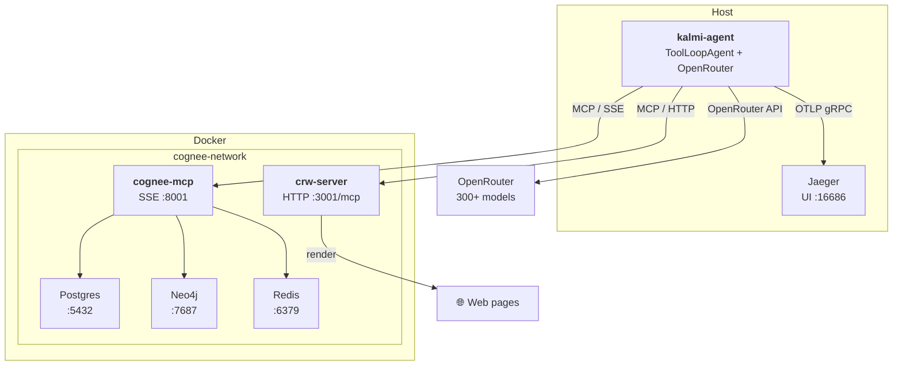
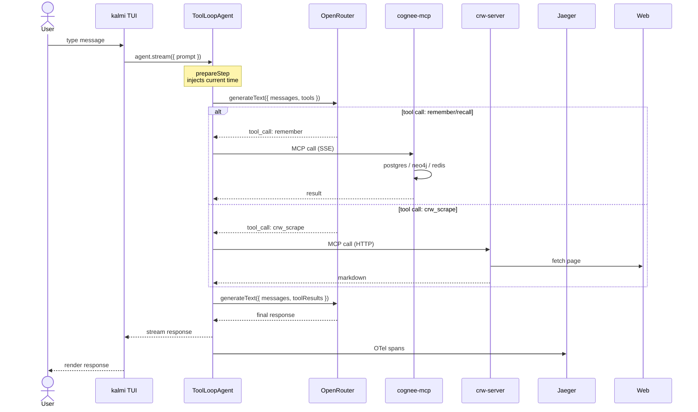

# kalmi

A terminal-based AI agent powered by the [Vercel AI SDK](https://sdk.vercel.ai/) with multi-server [MCP](https://modelcontextprotocol.io/) support — persistent memory via [cognee](https://cognee.ai/), web access via [FastCRW](https://fastcrw.com/), and OpenTelemetry tracing to [Jaeger](https://www.jaegertracing.io/).

## Architecture

### System



### Data Flow



## Prerequisites

- [Node.js](https://nodejs.org/) 20+
- [pnpm](https://pnpm.io/) 9+
- [Docker](https://www.docker.com/) with Compose

## Installation

```bash
git clone <repo-url> kalmi-agent
cd kalmi-agent
pnpm install
cp .env.example .env
```

Edit `.env` — at minimum set your OpenRouter key and model:

```dotenv
OPENROUTER_API_KEY=sk-or-v1-...
OPENROUTER_MODEL=openai/gpt-4o
```

### External services

Each service runs in Docker. Start them before launching kalmi.

#### Cognee (memory + knowledge graph)

```bash
# Clone and start the full stack
git clone https://github.com/topoteretes/cognee.git
cd cognee
cp .env.template .env
# Edit .env — set LLM_API_KEY, EMBEDDING_API_KEY, EMBEDDING_ENDPOINT, etc.

docker compose --profile mcp --profile neo4j --profile postgres --profile redis up -d

# Connect Redis if it misses the network (one-time)
docker network connect cognee-network redis
```

Services: postgres (:5432), neo4j (:7474 / :7687), redis (:6379), cognee-mcp (:8001/sse)

#### CRW / FastCRW (web scraping)

```bash
docker run -d \
  --name crw \
  --network cognee-network \
  -p 3001:3000 \
  ghcr.io/us/crw:latest
```

Exposes MCP endpoint at `http://localhost:3001/mcp` and REST API at `/v1/scrape`, `/v1/crawl`, `/v1/map`.

#### Jaeger (tracing)

```bash
docker volume create jaeger_data

docker run -d \
  --name jaeger \
  --user root \
  --network cognee-network \
  -p 4317:4317 \
  -p 4318:4318 \
  -p 16686:16686 \
  -e SPAN_STORAGE_TYPE=badger \
  -e BADGER_EPHEMERAL=false \
  -e BADGER_DIRECTORY_KEY=/tmp/jaeger \
  -e BADGER_DIRECTORY_VALUE=/tmp/jaeger \
  -v jaeger_data:/tmp/jaeger \
  jaegertracing/all-in-one:latest
```

UI at `http://localhost:16686`. Traces persist across restarts via the `jaeger_data` volume.

## Configuration

| Variable | Required | Default | Description |
|---|---|---|---|
| `OPENROUTER_API_KEY` | Yes | — | OpenRouter API key |
| `OPENROUTER_MODEL` | Yes | — | Default model (e.g. `openai/gpt-4o`, `anthropic/claude-sonnet`) |
| `MCP_SERVERS` | No | — | Comma-separated MCP server names (e.g. `cognee,crw`) |
| `MCP_{NAME}_TRANSPORT` | Per server | `http` | Transport type: `sse` or `http` |
| `MCP_{NAME}_URL` | Per server | — | MCP endpoint URL |
| `MCP_{NAME}_API_KEY` | Per server | — | Bearer token for authenticated servers |
| `MCP_{NAME}_HEADERS` | No | — | JSON object of additional headers |
| `OTEL_EXPORTER_OTLP_ENDPOINT` | No | `http://localhost:4317` | OTLP gRPC endpoint for tracing |

### Example `.env`

```dotenv
OPENROUTER_API_KEY=sk-or-v1-...
OPENROUTER_MODEL=openai/gpt-4o

MCP_SERVERS=cognee,crw
MCP_COGNEE_TRANSPORT=sse
MCP_COGNEE_URL=http://localhost:8001/sse
MCP_CRW_TRANSPORT=http
MCP_CRW_URL=http://localhost:3001/mcp

OTEL_EXPORTER_OTLP_ENDPOINT=http://localhost:4317
```

## Running

```bash
pnpm kalmi                    # start TUI with current session
pnpm kalmi --new <name>       # create a new session
pnpm kalmi --new <name> --prompt coder --model anthropic/claude-sonnet
pnpm kalmi --switch <id>      # switch to another session
pnpm kalmi --list             # list all sessions
pnpm kalmi --delete <id>      # delete a session
pnpm kalmi --prompts          # list available system prompts
pnpm kalmi --help             # show usage
```

## Sessions

kalmi sessions manage conversation identity and configuration. Each session stores:

- A UUID and name
- A system prompt (preset)
- A model ID
- A creation timestamp

Sessions are persisted in `.kalmi/sessions.json`. The current session is tracked automatically.

### Built-in prompts

| Name | Description |
|---|---|
| `default` | General-purpose assistant |
| `coder` | Software engineering assistant |
| `reviewer` | Code reviewer |
| `writer` | Writing and editing assistant |

## MCP Tools

When MCP servers are configured, the agent automatically discovers and merges all available tools. No manual wiring needed — add a server to `MCP_SERVERS` and configure its `MCP_{NAME}_*` vars.

### cognee

| Tool | Description |
|---|---|
| `remember` | Store data in memory (session cache or permanent graph) |
| `recall` | Retrieve data from memory (session-first, then graph) |
| `forget` | Delete dataset or all owned memory |
| `visualize_graph_ui` | Open knowledge graph visualization |
| `upload_file_ui` | Open workspace for file upload |

The agent is instructed to pass `session_id` (the kalmi session UUID) for fast session cache, or omit it for permanent graph storage.

### CRW (FastCRW)

| Tool | Description |
|---|---|
| `crw_scrape` | Fetch a URL and return clean markdown |
| `crw_crawl` | Multi-page crawl from a seed URL |
| `crw_map` | Discover all URLs on a site |
| `crw_extract` | Extract structured JSON from pages |
| `crw_parse_file` | Parse local PDFs to markdown |

## Adding a custom tool

Custom AI SDK tools go in `kalmi/tools/index.ts`:

```typescript
import { tool } from 'ai';
import { z } from 'zod';

const tools = {
  ...mcpTools,
  myTool: tool({
    description: 'Description for the LLM',
    parameters: z.object({ query: z.string() }),
    execute: async ({ query }) => {
      // your logic
      return 'result';
    },
  }),
};
```

## Tracing

kalmi exports OpenTelemetry spans to Jaeger. Spans follow [GenAI semantic conventions](https://opentelemetry.io/docs/specs/semconv/gen-ai/) — each agent turn produces:

```
invoke_agent {model}         ← root span
  ├── chat {model}           ← each LLM step
  │   ├── execute_tool ...   ← MCP tool calls
  │   └── ...
  └── ...
```

Set `OTEL_EXPORTER_OTLP_ENDPOINT` in `.env` (defaults to `http://localhost:4317`). Open `http://localhost:16686` and select service `kalmi`. Tracer setup lives in `kalmi/ops/telemetry.ts`.

## Chat Logs

Every conversation turn is automatically logged to `.kalmi/logs/{sessionId}.jsonl` — one JSON object per line, containing the user prompt, assistant response, and any tool calls with their results.

```jsonl
{"timestamp":"2026-07-20T12:00:00Z","user":"tell me about plekhanov","assistant":"Plekhanov was...","toolCalls":[{"name":"remember","args":{"data":"..."}}],"toolResults":[{"name":"remember","result":"..."}]}
```

Inspect logs directly from the terminal:

```bash
cat .kalmi/logs/<uuid>.jsonl | jq .user
cat .kalmi/logs/<uuid>.jsonl | jq .toolCalls
```

Logs are per-session, append-only, and isolated — each kalmi session UUID gets its own file.

## Directory Structure

```
kalmi-agent/
├── kalmi/
│   ├── agent.ts              # main entrypoint — TUI + ToolLoopAgent
│   ├── ops/
│   │   └── telemetry.ts      # OTel tracer setup + AI SDK integration
│   ├── tools/
│   │   ├── index.ts          # merges MCP tools + custom tools
│   │   └── mcp.ts            # multi-server MCP client manager
│   └── runtime/
│       ├── index.ts          # re-exports
│       ├── types.ts          # Session, PromptDefinition
│       ├── session.ts        # session CRUD backed by .kalmi/sessions.json
│       ├── prompts.ts        # built-in system prompts
│       └── chatlog.ts        # JSONL turn logger
├── .env.example
├── package.json
├── tsconfig.json
└── .kalmi/                   # generated
    ├── sessions.json         # session store
    └── logs/                 # per-session JSONL chat logs
```

## Roadmap

- [x] **Core agent** — ToolLoopAgent with OpenRouter, session management, and MCP multi-server support
- [x] **Persistent memory + RAG** — Knowledge graph via cognee (Neo4j + Postgres + Redis), session-scoped caching
- [x] **Web access** — Scraping, crawling, and site mapping via CRW / FastCRW
- [x] **Observability** — OpenTelemetry tracing to Jaeger, JSONL conversation logs
- [ ] **Discord gateway** — Bot interface for Discord servers
- [ ] **Telegram gateway** — Bot interface for Telegram chats
- [ ] **Skills** — Reusable prompt + tool packs for domain-specific workflows
- [ ] **Events scheduler** — Cron-based background tasks (recurring scrapes, scheduled summarization)
- [ ] **Evaluation** — LLM-as-judge for measuring response quality and tool use accuracy
